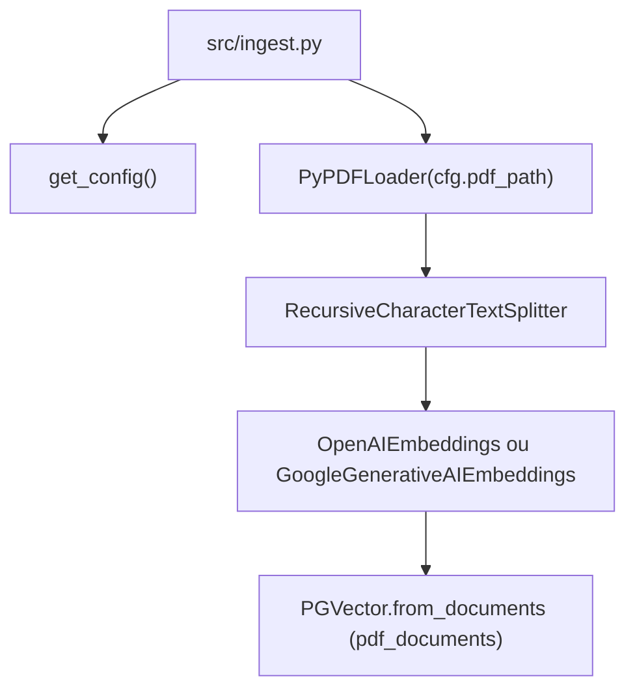

# F02 — Ingestão de PDF

## Scope

### Included
- `src/ingest.py` — pipeline completo: carrega PDF → divide em chunks → gera embeddings → armazena no pgVector com `pre_delete_collection=True` (re-ingestão idempotente)

### Input Contracts
Consome de F01 via `get_config()`:
- `cfg.provider` — `"openai"` ou `"gemini"`
- `cfg.api_key` — chave do provedor selecionado
- `cfg.embedding_model` — modelo de embedding resolvido (`"text-embedding-3-small"` ou `"models/embedding-001"`)
- `cfg.pdf_path` — caminho para o arquivo PDF
- `cfg.connection_string` — string de conexão PostgreSQL com driver psycopg
- `cfg.collection_name` — nome da coleção pgVector (default: `"pdf_documents"`)

### Output Contracts
Fornece para F03:
- Coleção `pdf_documents` no pgVector contendo N vetores, cada um com `page_content` e metadados de origem (número de página via PyPDFLoader)

---

## Architecture Impact

| File | New/Modified | Purpose |
|---|---|---|
| `src/ingest.py` | Modified | CLI entry point do pipeline de ingestão de PDF |
| `tests/test_ingest.py` | New | Testes unitários do pipeline de ingestão |



---

## Technical Decisions

| Decision | Chosen Approach | Alternative Considered | Trade-off |
|---|---|---|---|
| Detecção de PDF sem texto | `len(chunks) == 0` após `split_documents()` | Checar `page_content` das páginas brutas antes de dividir | Mais simples; captura todos os casos sem texto num único ponto do pipeline |
| Fonte do modelo de embedding | `cfg.embedding_model` (resolvido pelo config) | Hardcode dos nomes dos modelos no ingest.py | Consistente com o padrão do config; permite override via env var sem alterar código |
| Inicialização do PGVector | `PGVector.from_documents()` class method | Instanciar PGVector + chamar `add_documents()` | Uma chamada que encapsula embed + store; `pre_delete_collection=True` é argumento do construtor |

---

## Component Overview

| File Path | New/Modified | Purpose | Key Responsibilities |
|---|---|---|---|
| `src/ingest.py` | Modified | Entry point do pipeline de ingestão | Carregar PDF, dividir em chunks, gerar embeddings, armazenar no pgVector, imprimir mensagem de conclusão, tratar os 4 caminhos de erro |
| `tests/test_ingest.py` | New | Testes unitários do pipeline | Mockar PyPDFLoader, RecursiveCharacterTextSplitter e PGVector.from_documents; verificar mensagens de erro em stderr; verificar mensagem de conclusão em stdout |

**`src/ingest.py` — estrutura da função `ingest_pdf()`:**

```
ingest_pdf()
  ├── cfg = get_config()
  ├── PyPDFLoader(cfg.pdf_path).load()
  │     └── FileNotFoundError → stderr + sys.exit(1)
  ├── RecursiveCharacterTextSplitter(chunk_size=1000, chunk_overlap=150).split_documents(docs)
  ├── len(chunks) == 0 → stderr + sys.exit(1)
  ├── instanciar embedding
  │     ├── provider="openai" → OpenAIEmbeddings(model=cfg.embedding_model)
  │     └── provider="gemini" → GoogleGenerativeAIEmbeddings(model=cfg.embedding_model)
  ├── PGVector.from_documents(
  │       documents=chunks,
  │       embedding=embedding,
  │       connection=cfg.connection_string,
  │       collection_name=cfg.collection_name,
  │       pre_delete_collection=True
  │     )
  │     ├── sqlalchemy.exc.OperationalError → stderr + sys.exit(1)
  │     └── AuthenticationError / GoogleAPIError → stderr + sys.exit(1)
  └── print(f"Ingestão concluída: {len(chunks)} chunks armazenados na coleção 'pdf_documents'.")
```

---

## Error Handling

Derivado do bloco **Error Handling** do PRD F02:

| Condição | Exceção capturada | Mensagem impressa (stderr) | Exit code |
|---|---|---|---|
| Arquivo PDF não encontrado | `FileNotFoundError` de `PyPDFLoader.load()` | `"Arquivo PDF não encontrado: [cfg.pdf_path]. Verifique a variável PDF_PATH no .env."` | 1 |
| PDF sem texto extraível | `len(chunks) == 0` (sem exceção — verificação condicional) | `"O PDF não contém texto legível. Verifique se o arquivo possui camada de texto."` | 1 |
| Conexão com banco recusada | `sqlalchemy.exc.OperationalError` de `PGVector.from_documents()` | `"Falha ao conectar ao banco de dados. Verifique se o Docker está rodando: docker compose up -d"` | 1 |
| Chave de API inválida ou cota excedida | `openai.AuthenticationError` / `google.api_core.exceptions.GoogleAPIError` de `PGVector.from_documents()` | `"Falha de autenticação com [OpenAI\|Gemini]: [str(e)]."` | 1 |

**Nota sobre distinção de erros:** `PGVector.from_documents()` conecta ao banco primeiro (para executar o `pre_delete_collection`) e só depois chama a API de embedding. Capturar `sqlalchemy.exc.OperationalError` antes das exceções específicas de SDK garante que erros de DB e erros de API sejam reportados com mensagens distintas. O nome do provedor na mensagem de autenticação é derivado de `cfg.provider`: `"openai"` → `"OpenAI"`, `"gemini"` → `"Gemini"`.

---

## Testing Strategy

| Test File | Test Type | Target | Coverage Goal |
|---|---|---|---|
| `tests/test_ingest.py` | Unit | `src/ingest.py` — `ingest_pdf()` | Todos os 4 caminhos de erro + caminho feliz |

**Estrutura dos testes (padrão class-based de `tests/test_config.py`):**

```
test_ingest.py
  sys.path.insert(0, "src")
  from ingest import ingest_pdf

  class TestPdfErrors:
    test_pdf_not_found_exits_with_code_1
      Dado: mock de PyPDFLoader.load() levantando FileNotFoundError
      Quando: ingest_pdf() é chamada
      Então: stderr contém "Arquivo PDF não encontrado"
             sys.exit(1) levantado

    test_empty_pdf_exits_with_code_1
      Dado: mock de PyPDFLoader.load() retornando docs com page_content vazio;
            splitter retorna lista vazia
      Quando: ingest_pdf() é chamada
      Então: stderr contém "O PDF não contém texto legível"
             sys.exit(1) levantado

  class TestDatabaseError:
    test_db_connection_refused_exits_with_code_1
      Dado: mock de PGVector.from_documents levantando OperationalError
      Quando: ingest_pdf() é chamada
      Então: stderr contém "Falha ao conectar ao banco de dados"
             sys.exit(1) levantado

  class TestApiError:
    test_invalid_api_key_exits_with_code_1
      Dado: mock de PGVector.from_documents levantando AuthenticationError (ou GoogleAPIError)
      Quando: ingest_pdf() é chamada
      Então: stderr contém "Falha de autenticação com"
             sys.exit(1) levantado

  class TestSuccessfulIngestion:
    test_completion_message_contains_chunk_count
      Dado: pipeline completo mockado com N chunks (ex: 42)
      Quando: ingest_pdf() é chamada
      Então: stdout contém "Ingestão concluída: 42 chunks armazenados na coleção 'pdf_documents'."

    test_pre_delete_collection_true_is_passed
      Dado: pipeline completo mockado
      Quando: ingest_pdf() é chamada
      Então: PGVector.from_documents foi chamado com pre_delete_collection=True
```

**Testes de aceitação (manual — requerem infraestrutura viva):**

```
test_ingest_completes_without_error
  Execução: python src/ingest.py (com .env válido e docker compose up -d)
  Verificação: exit code 0; mensagem de conclusão com N > 0

test_collection_has_exact_chunk_count
  Execução: SELECT COUNT(*) FROM langchain_pg_embedding e
            JOIN langchain_pg_collection c ON e.collection_id = c.uuid
            WHERE c.name = 'pdf_documents';
  Verificação: contagem == N reportado na mensagem de conclusão

test_reingest_same_chunk_count
  Execução: python src/ingest.py duas vezes consecutivas sem alterar o PDF
  Verificação: mesma contagem de chunks nas duas execuções (sem duplicatas)
```
