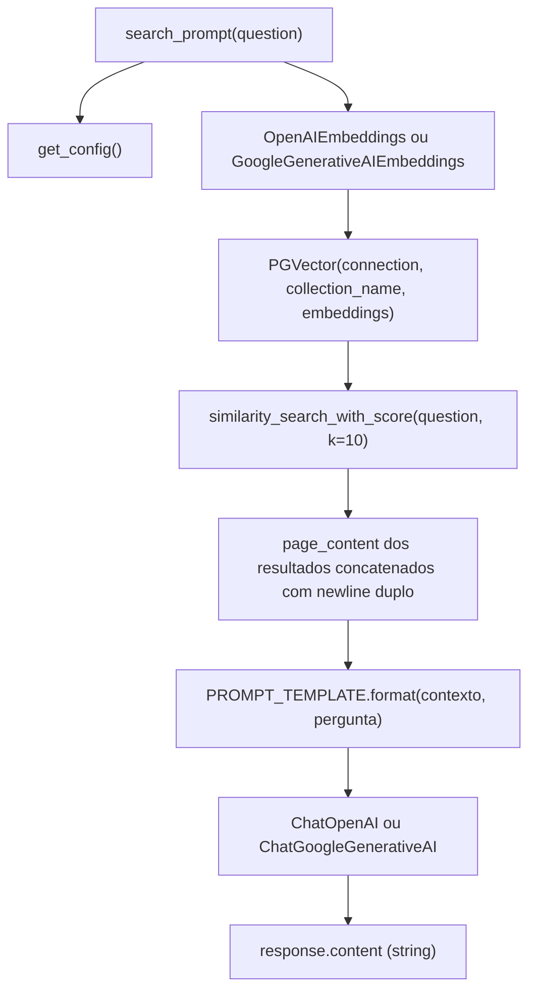

# F03 — Busca Semântica e Resposta do LLM

## Scope

### Included
- Completar `src/search.py` com a implementação de `search_prompt(question)`: vetoriza a pergunta via embedding, recupera os 10 blocos mais similares do pgVector, monta o `PROMPT_TEMPLATE` já definido no arquivo, invoca o LLM configurado com timeout de 30 segundos e retorna o conteúdo da resposta como string simples
- `tests/test_search.py` — testes unitários cobrindo os 3 caminhos de erro e o caminho feliz (2 provedores)

### Input Contracts
Consome de F01 via `get_config()`:
- `cfg.provider` — `"openai"` ou `"gemini"`
- `cfg.api_key` — chave do provedor selecionado
- `cfg.embedding_model` — modelo de embedding resolvido pelo config
- `cfg.connection_string` — string de conexão PostgreSQL com driver psycopg
- `cfg.collection_name` — nome da coleção pgVector (default `"pdf_documents"`)

Consome de F02:
- Coleção `pdf_documents` no pgVector contendo N vetores, cada um com campo `page_content`

### Output Contracts
Fornece para F04:
- String de resposta retornada por `search_prompt(question)` — conteúdo gerado pelo LLM, mensagem de recusa padrão ou mensagem de erro, dependendo do resultado da busca

---

## Architecture Impact

| File | New/Modified | Purpose |
|---|---|---|
| `src/search.py` | Modified | Completar `search_prompt()` com integração pgVector (leitura) + LLM |
| `tests/test_search.py` | New | Testes unitários da função `search_prompt()` |



---

## Technical Decisions

| Decision | Chosen Approach | Alternative Considered | Trade-off |
|---|---|---|---|
| Instanciação do PGVector para leitura | Construtor `PGVector(connection=..., collection_name=..., embeddings=embedding)` + `.similarity_search_with_score()` | `PGVector.from_documents()` (write path, usado no ingest) | Separação clara entre paths de escrita (ingest) e leitura (search); evita re-criar ou sobrescrever a coleção acidentalmente |
| Tratamento de erros | Retornar string de erro em vez de `sys.exit(1)` | `sys.exit(1)` como em `ingest.py` | F03 é chamado dentro do loop interativo do F04; erros devem ser exibidos como respostas ao usuário, não encerrar o processo |
| LLM timeout | `timeout=30` no `ChatOpenAI` e `request_timeout=30` no `ChatGoogleGenerativeAI` | Sem timeout (aguardar indefinidamente) | Garante que o loop interativo do F04 nunca trave por mais de 30 segundos numa única pergunta |
| Invocação do LLM | `llm.invoke(prompt_string)` passando a string já formatada pelo `PROMPT_TEMPLATE` | LCEL com `PromptTemplate | llm` | Menor overhead para esse caso simples; `PROMPT_TEMPLATE` já está definido como string formatável no arquivo e não precisa ser convertido para `PromptTemplate` |
| Captura de timeout vs. erro genérico de API | `except (openai.APITimeoutError, google.api_core.exceptions.DeadlineExceeded)` antes de `except (openai.APIError, google.api_core.exceptions.GoogleAPIError)` | Captura individual por provedor em blocos separados | Unificado reduz duplicação; a ordem garante que timeout (subclasse) seja capturado antes do handler genérico |

---

## Component Overview

| File Path | New/Modified | Purpose | Key Responsibilities |
|---|---|---|---|
| `src/search.py` | Modified | Pipeline de busca semântica e resposta do LLM | Instanciar embedding e PGVector, executar similarity search com k=10, montar prompt com PROMPT_TEMPLATE, invocar LLM, tratar 3 caminhos de erro, retornar string |
| `tests/test_search.py` | New | Testes unitários de `search_prompt()` | Mockar PGVector e LLM via monkeypatch; verificar strings retornadas nos caminhos de erro; verificar `response.content` no caminho feliz; verificar uso do provedor correto (openai vs gemini) |

**`src/search.py` — estrutura completa de `search_prompt(question)`:**

```
search_prompt(question)
  ├── cfg = get_config()
  ├── instanciar embedding (mesmo padrão do ingest.py)
  │     ├── provider="openai" → OpenAIEmbeddings(model=cfg.embedding_model)
  │     └── provider="gemini" → GoogleGenerativeAIEmbeddings(model=cfg.embedding_model)
  ├── vectorstore = PGVector(
  │       connection=cfg.connection_string,
  │       collection_name=cfg.collection_name,
  │       embeddings=embedding
  │     )
  ├── try: results = vectorstore.similarity_search_with_score(question, k=10)
  │     except Exception → return "Nenhum documento encontrado no banco. Execute python src/ingest.py primeiro."
  ├── if not results → return "Nenhum documento encontrado no banco. Execute python src/ingest.py primeiro."
  ├── contexto = "\n\n".join(doc.page_content for doc, _ in results)
  ├── prompt = PROMPT_TEMPLATE.format(contexto=contexto, pergunta=question)
  ├── instanciar LLM
  │     ├── provider="openai" → ChatOpenAI(model="gpt-5-nano", timeout=30)
  │     └── provider="gemini" → ChatGoogleGenerativeAI(model="gemini-2.5-flash-lite", request_timeout=30)
  ├── try: response = llm.invoke(prompt)
  │     except (openai.APITimeoutError, google.api_core.exceptions.DeadlineExceeded)
  │       → return "Tempo limite excedido ao chamar a LLM. Tente novamente."
  │     except (openai.APIError, google.api_core.exceptions.GoogleAPIError) as e
  │       → return f"Erro ao obter resposta da LLM: {str(e)}."
  └── return response.content
```

**Importações adicionais necessárias em `src/search.py`:**
```
import openai
import google.api_core.exceptions
from langchain_openai import OpenAIEmbeddings, ChatOpenAI
from langchain_google_genai import GoogleGenerativeAIEmbeddings, ChatGoogleGenerativeAI
from langchain_postgres import PGVector
```

---

## Error Handling

Derivado do bloco **Error Handling** do PRD F03. Todos os erros são **retornados como strings** (não `sys.exit(1)`), pois `search_prompt` é chamada de dentro do loop interativo do F04 e erros devem ser exibidos como respostas ao usuário.

| Condição | Mecanismo de detecção | String retornada |
|---|---|---|
| Coleção `pdf_documents` inexistente ou falha ao acessar o banco | Exceção capturada em `vectorstore.similarity_search_with_score()` | `"Nenhum documento encontrado no banco. Execute python src/ingest.py primeiro."` |
| Coleção existe mas está vazia | Lista vazia retornada por `similarity_search_with_score()` | `"Nenhum documento encontrado no banco. Execute python src/ingest.py primeiro."` |
| Timeout da API do LLM (resposta excede 30 segundos) | `openai.APITimeoutError` ou `google.api_core.exceptions.DeadlineExceeded` em `llm.invoke()` | `"Tempo limite excedido ao chamar a LLM. Tente novamente."` |
| Erro de API do LLM (limite de taxa, erro de servidor) | `openai.APIError` ou `google.api_core.exceptions.GoogleAPIError` em `llm.invoke()` | `"Erro ao obter resposta da LLM: [str(e)]."` |

**Nota sobre ordem de captura:** `openai.APITimeoutError` é subclasse de `openai.APIError`; analogamente, `DeadlineExceeded` é subclasse de `GoogleAPIError`. O bloco de timeout deve sempre preceder o bloco de erro genérico no mesmo bloco `try/except`.

---

## Testing Strategy

| Test File | Test Type | Target | Coverage Goal |
|---|---|---|---|
| `tests/test_search.py` | Unit | `src/search.py` — `search_prompt()` | Todos os 3 caminhos de erro + caminho feliz com ambos os provedores |

**Estrutura dos testes (padrão class-based de `tests/test_ingest.py`):**

```
test_search.py
  sys.path.insert(0, "src")
  from search import search_prompt

  OPENAI_ENV = {"OPENAI_API_KEY": "sk-test"}
  GEMINI_ENV = {"GOOGLE_API_KEY": "AIza-test"}

  MOCK_DOCS = [(MagicMock(page_content=f"chunk {i}"), 0.9) for i in range(10)]

  def _apply_base_mocks(monkeypatch, search_results=MOCK_DOCS, llm_side_effect=None, llm_content="Resposta mockada"):
    # monkeypatch: OpenAIEmbeddings, PGVector, ChatOpenAI
    # vectorstore_mock.similarity_search_with_score.return_value = search_results
    # llm_mock.invoke.return_value = MagicMock(content=llm_content)
    # se llm_side_effect: llm_mock.invoke.side_effect = llm_side_effect

  class TestEmptyCollection:
    test_empty_results_returns_no_docs_message
      Dado: similarity_search_with_score retorna []
      Quando: search_prompt("qualquer pergunta") é chamada (OPENAI_ENV)
      Então: retorna "Nenhum documento encontrado no banco. Execute python src/ingest.py primeiro."

    test_vectorstore_exception_returns_no_docs_message
      Dado: similarity_search_with_score levanta Exception("relation does not exist")
      Quando: search_prompt("qualquer pergunta") é chamada (OPENAI_ENV)
      Então: retorna "Nenhum documento encontrado no banco. Execute python src/ingest.py primeiro."

  class TestLlmErrors:
    test_llm_timeout_returns_timeout_message
      Dado: llm.invoke levanta openai.APITimeoutError
      Quando: search_prompt("pergunta") é chamada (OPENAI_ENV)
      Então: retorna "Tempo limite excedido ao chamar a LLM. Tente novamente."

    test_llm_api_error_returns_error_message
      Dado: llm.invoke levanta openai.APIError com mensagem "rate limit exceeded"
      Quando: search_prompt("pergunta") é chamada (OPENAI_ENV)
      Então: retorna string iniciando com "Erro ao obter resposta da LLM:"

  class TestSuccessfulSearch:
    test_returns_llm_response_content
      Dado: 10 docs mockados; llm.invoke retorna AIMessage com content="Resposta do LLM"
      Quando: search_prompt("pergunta dentro do contexto") é chamada (OPENAI_ENV)
      Então: retorna "Resposta do LLM"

    test_context_joined_with_double_newline
      Dado: 3 docs com page_content ["a", "b", "c"]; similarity_search_with_score retorna esses 3
      Quando: search_prompt() é chamada e o prompt enviado ao LLM é capturado
      Então: prompt contém "a\n\nb\n\nc" no bloco CONTEXTO

    test_gemini_provider_uses_gemini_classes
      Dado: GEMINI_ENV; mocks de GoogleGenerativeAIEmbeddings e ChatGoogleGenerativeAI
      Quando: search_prompt("pergunta") é chamada
      Então: ChatGoogleGenerativeAI foi instanciado; ChatOpenAI não foi instanciado
```

**Testes de aceitação (requerem infraestrutura viva — manual):**

```
test_search_prompt_returns_content_for_in_context_question
  Pré-condição: python src/ingest.py concluído com sucesso
  Execução: search_prompt("Qual o faturamento da Empresa X?")
  Verificação: string não vazia; não é a mensagem de recusa padrão

test_search_prompt_returns_refusal_for_out_of_context_question
  Execução: search_prompt("Qual é a capital da França?")
  Verificação: retorna exatamente "Não tenho informações necessárias para responder sua pergunta."

test_search_prompt_returns_no_docs_before_ingest
  Pré-condição: coleção pdf_documents não existe
  Execução: search_prompt("qualquer")
  Verificação: retorna "Nenhum documento encontrado no banco. Execute python src/ingest.py primeiro."

test_both_providers_return_valid_response
  Execução: testar com PROVIDER=openai e PROVIDER=gemini (chaves de API válidas)
  Verificação: ambos retornam string não vazia para pergunta dentro do contexto
```

**Critério de integração Cross-Feature (PRD Seção 9):**

```
test_ingest_then_search_retrieves_non_empty_context
  Execução: após ingest.py (F02) concluir, chamar search_prompt() (F03)
  Verificação: os 10 blocos recuperados produzem um bloco CONTEXTO não vazio no prompt do LLM
               (confirmado por log ou inspeção do mock em teste de integração)

test_provider_mismatch_produces_dimension_error_not_wrong_answer
  Execução: ingerir com PROVIDER=openai, tentar buscar com PROVIDER=gemini (sem re-ingerir)
  Verificação: retorna erro de incompatibilidade de dimensão (não resposta silenciosamente errada)
```
