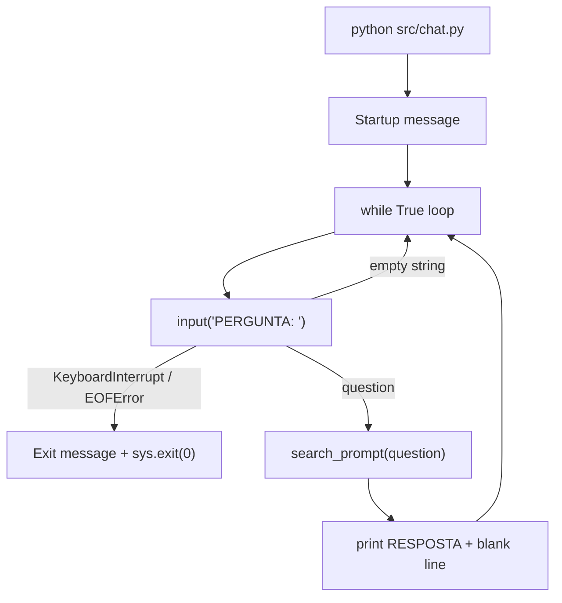

# F04 — Interface de Chat via CLI

## Scope

### Included
- Reescrever `src/chat.py` substituindo o esqueleto existente pela implementação completa do loop interativo: mensagem de inicialização, loop `while True`, leitura de input via `input("PERGUNTA: ")`, ignorar entradas vazias (no-op), chamar `search_prompt(question)`, imprimir `"RESPOSTA: {response}\n"`, e capturar `KeyboardInterrupt`/`EOFError` para encerramento limpo com mensagem e código de saída 0
- `tests/test_chat.py` — testes unitários cobrindo startup, no-op, formatação e verbatim da resposta, e encerramento com Ctrl+C e EOF

### Input Contracts
Consome de F03 via importação direta:
- `search_prompt(question: str) -> str` de `src/search.py`
  - Retorna texto de resposta do LLM, mensagem de recusa padrão, ou string de erro (nunca levanta exceção)

---

## Architecture Impact

| File | New/Modified | Purpose |
|---|---|---|
| `src/chat.py` | Modified | Loop interativo de CLI completo |
| `tests/test_chat.py` | New | Testes unitários do loop de chat |



---

## Technical Decisions

| Decision | Chosen Approach | Alternative Considered | Trade-off |
|---|---|---|---|
| Captura de terminação | `except (KeyboardInterrupt, EOFError)` em bloco único envolvendo `input()` | Blocos `except` separados por tipo, ou `signal.signal(signal.SIGINT, ...)` | Reduz duplicação; ambas as condições resultam no mesmo fluxo de saída limpa; `signal` seria overkill para CLI simples |
| Chamada de `search_prompt` | Chamar `search_prompt(question)` a cada pergunta no loop | Instanciar PGVector/LLM fora do loop e reutilizar entre perguntas | Consistente com a API pública de F03; cada pergunta é independente por design do PRD; overhead de reconexão aceitável para CLI interativa |
| Remoção de `get_config()` de `chat.py` | Remover chamada e import de `get_config` do esqueleto existente | Manter para validação antecipada de config antes do loop iniciar | `search_prompt` gerencia config internamente; import desnecessário cria acoplamento extra e pode confundir sobre quem é responsável pela config |
| Código de saída | `sys.exit(0)` após mensagem de encerramento | `return` de `main()` sem `sys.exit` | Sinaliza explicitamente saída limpa ao SO; `return` de `main()` resulta em código 0 implícito, mas `sys.exit(0)` torna a intenção explícita e verificável em testes |

---

## Component Overview

| File Path | New/Modified | Purpose | Key Responsibilities |
|---|---|---|---|
| `src/chat.py` | Modified | Loop interativo de CLI | Imprimir mensagem de inicialização; implementar loop `while True`; ler `input()` com prompt "PERGUNTA: "; ignorar entradas vazias via `continue`; chamar `search_prompt(question)`; imprimir "RESPOSTA:" seguido de linha em branco; capturar `KeyboardInterrupt`/`EOFError` e encerrar com mensagem e `sys.exit(0)` |
| `tests/test_chat.py` | New | Testes unitários do loop de chat | Mockar `search_prompt` e `builtins.input`; verificar mensagem de inicialização; verificar formatação "RESPOSTA:"; verificar no-op em entrada vazia e apenas-espaços; verificar transmissão verbatim da resposta; verificar múltiplas perguntas em sequência; verificar saída com código 0 em Ctrl+C e EOF |

**`src/chat.py` — estrutura completa de `main()`:**

```
import sys
from search import search_prompt

def main():
  ├── print("Chat iniciado. Digite sua pergunta ou Ctrl+C para sair.\n")
  └── while True:
        ├── try: question = input("PERGUNTA: ")
        │     except (KeyboardInterrupt, EOFError):
        │       print("\nEncerrando o chat. Até logo!")
        │       sys.exit(0)
        ├── if not question.strip() → continue
        ├── response = search_prompt(question)
        └── print(f"RESPOSTA: {response}\n")

if __name__ == "__main__":
    main()
```

---

## Error Handling

F04 não define erros de execução próprios — erros da camada de busca são tratados por F03 e retornados como strings. F04 apenas os exibe como respostas ao usuário.

| Condição | Mecanismo de detecção | Comportamento |
|---|---|---|
| Ctrl+C pressionado durante `input()` | `KeyboardInterrupt` capturado no `try/except` do loop | Imprime `"\nEncerrando o chat. Até logo!"` e chama `sys.exit(0)` |
| EOF (Ctrl+D no Linux/macOS) durante `input()` | `EOFError` capturado no mesmo bloco `except` | Mesmo comportamento que `KeyboardInterrupt` |
| Entrada vazia (Enter sem texto) | `not question.strip()` avaliado após `input()` retornar | `continue` — re-exibe "PERGUNTA: " sem chamar `search_prompt` |
| Entrada apenas com espaços | `not question.strip()` — `.strip()` resulta em string vazia | Mesmo tratamento que entrada vazia |
| Erros de busca/LLM | Strings de erro retornadas por `search_prompt` (F03) | Exibidas verbatim sob o prefixo "RESPOSTA:" — nenhum tratamento adicional em F04 |

---

## Testing Strategy

| Test File | Test Type | Target | Coverage Goal |
|---|---|---|---|
| `tests/test_chat.py` | Unit | `src/chat.py` — `main()` | Todos os caminhos do loop: startup, no-op, resposta, encerramento |

**Padrão de mocking (seguindo `tests/test_search.py`):**
- `monkeypatch.setattr("builtins.input", side_effect=[...])` — controla o fluxo do loop via sequência de retornos ou exceções
- `monkeypatch.setattr("chat.search_prompt", MagicMock(...))` — isola `search_prompt` de F03
- `capsys.readouterr()` — captura stdout para verificar mensagens impressas
- `pytest.raises(SystemExit) as exc; assert exc.value.code == 0` — verifica código de saída

**Estrutura dos testes:**

```
test_chat.py
  sys.path.insert(0, "src")
  import pytest
  from unittest.mock import MagicMock, patch
  from chat import main

  class TestStartup:
    test_startup_message_is_printed
      Dado: input() levanta KeyboardInterrupt na primeira chamada
      Quando: main() é chamada (envolvida em pytest.raises(SystemExit))
      Então: stdout contém "Chat iniciado. Digite sua pergunta ou Ctrl+C para sair."

  class TestEmptyInput:
    test_empty_input_is_no_op
      Dado: input() retorna "" na 1ª chamada, depois KeyboardInterrupt na 2ª
             search_prompt mockado (não deve ser chamado)
      Quando: main() é chamada
      Então: "RESPOSTA:" não aparece no stdout; search_prompt.call_count == 0

    test_whitespace_only_input_is_no_op
      Dado: input() retorna "   " na 1ª chamada, depois KeyboardInterrupt na 2ª
      Quando: main() é chamada
      Então: "RESPOSTA:" não aparece no stdout

  class TestResponse:
    test_question_produces_resposta_prefix
      Dado: input() retorna "Qual a receita?" na 1ª, KeyboardInterrupt na 2ª
             search_prompt retorna "R$ 10 milhões"
      Quando: main() é chamada
      Então: stdout contém "RESPOSTA: R$ 10 milhões"

    test_response_followed_by_blank_line
      Dado: input() retorna "pergunta", depois KeyboardInterrupt
             search_prompt retorna "qualquer"
      Quando: main() é chamada
      Então: stdout contém "RESPOSTA: qualquer\n\n" (resposta seguida por linha em branco)

    test_response_is_verbatim
      Dado: search_prompt retorna "Texto exato com acentuação e número 123"
      Quando: main() é chamada e exibe a resposta
      Então: stdout contém exatamente "RESPOSTA: Texto exato com acentuação e número 123"

    test_multiple_questions_produce_multiple_responses
      Dado: input() retorna "q1", "q2", depois KeyboardInterrupt
             search_prompt retorna "r1" na 1ª chamada, "r2" na 2ª
      Quando: main() é chamada
      Então: stdout contém "RESPOSTA: r1" e "RESPOSTA: r2"; search_prompt.call_count == 2

  class TestTermination:
    test_keyboard_interrupt_exits_with_code_0
      Dado: input() levanta KeyboardInterrupt
      Quando: main() é chamada
      Então: pytest.raises(SystemExit) com exc.value.code == 0

    test_eof_exits_with_code_0
      Dado: input() levanta EOFError
      Quando: main() é chamada
      Então: pytest.raises(SystemExit) com exc.value.code == 0

    test_exit_message_printed_on_ctrl_c
      Dado: input() levanta KeyboardInterrupt
      Quando: main() é chamada (envolvida em pytest.raises(SystemExit))
      Então: stdout contém "Encerrando o chat. Até logo!"

    test_exit_message_printed_on_eof
      Dado: input() levanta EOFError
      Quando: main() é chamada (envolvida em pytest.raises(SystemExit))
      Então: stdout contém "Encerrando o chat. Até logo!"
```

**Testes de aceitação (requerem execução manual):**

```
test_chat_enters_loop_and_prints_startup
  Pré-condição: python src/ingest.py executado com sucesso
  Execução: python src/chat.py (interrompido com Ctrl+C imediatamente)
  Verificação: stdout contém "Chat iniciado. Digite sua pergunta ou Ctrl+C para sair."

test_empty_enter_redisplays_prompt
  Execução: pressionar Enter sem digitar; verificar que "RESPOSTA:" não é impresso

test_multiple_questions_get_independent_responses
  Execução: enviar 3 perguntas diferentes sobre o PDF; verificar 3 prefixos "RESPOSTA:" distintos

test_ctrl_c_exits_cleanly
  Execução: Ctrl+C durante o prompt
  Verificação: imprime "Encerrando o chat. Até logo!"; processo retorna código 0
```

**Critério de integração Cross-Feature (PRD Seção 9):**

```
test_llm_response_displayed_verbatim
  Dado: search_prompt (F03) retorna texto específico gerado pelo LLM
  Quando: chat.py (F04) exibe sob o prefixo "RESPOSTA:"
  Então: texto aparece sem modificação ou truncamento — conteúdo completo de response.content
```
